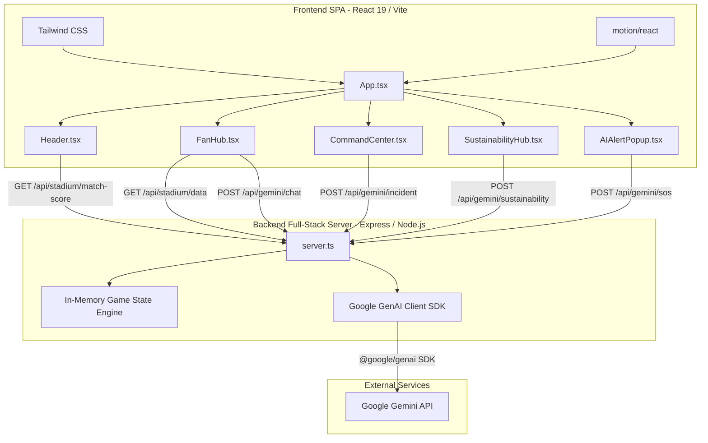
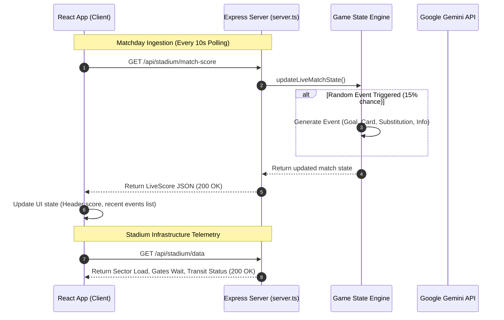
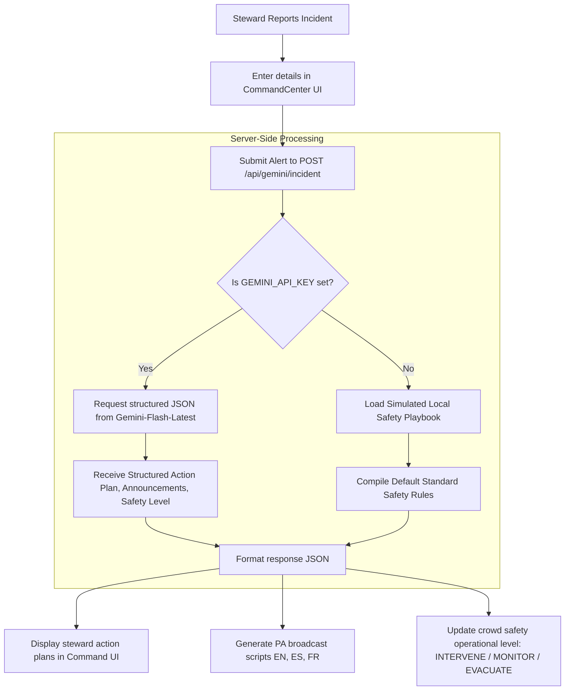
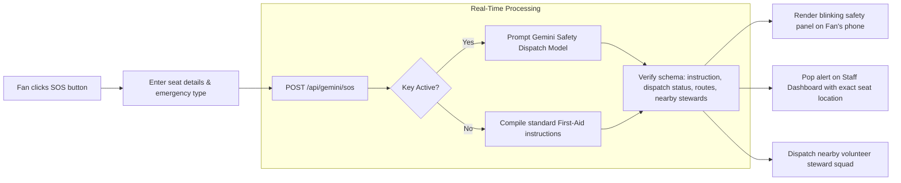

# Estadio Azteca Operations Command Center (ArenaIntel) — FIFA World Cup 2026

ArenaIntel is a full-stack, production-ready Stadium Operations Command Center and Spectator Services platform engineered for the **FIFA World Cup 2026** at the historic **Estadio Azteca, Mexico City**. 

The system provides live telemetry monitoring, real-time match stats, AI-augmented incident dispatch, instant crowd density simulation, public transit/gate flow management, and interactive spectator guidance in over 100+ languages—powered by the state-of-the-art **Gemini API**.

---

## 🏗️ Technical Architecture

The platform uses a unified, full-stack architecture running **React 19 + TypeScript + Vite** on the frontend, and a high-performance **Express + tsx** server on the backend. Production builds are bundled cleanly into an optimized CommonJS bundle (`dist/server.cjs`) using **esbuild** for cold-start speed and reliability.



---

## 🔄 Core System Workflows

### 1. Live Telemetry & Score Ingestion Pipeline
This sequence diagram illustrates how live game states and stadium telemetry (gate congestion, transit delays, weather metrics) are served and updated in real-time.



### 2. Incident Management & GenAI Decision Loop
When an operational incident occurs (e.g., gate congestion, localized fire, medical hazard), safety personnel dispatch the incident to the CommandCenter. The system requests immediate operational tactics and public-facing announcements from the Gemini API.



### 3. Emergency SOS Spectator Support Workflow
If a spectator is injured, experiences heat stroke, or detects an immediate risk, they can activate the emergency SOS button. This routes coordinates directly to the command desk and uses Gemini to issue tailored medical reassurance.



---

## 🔌 API Reference Document

### 1. Matchday Telemetry Data
* **Endpoint:** `GET /api/stadium/data`
* **Response Content Type:** `application/json`
* **Description:** Returns the live operational data of Estadio Azteca, including sector queues, transit statuses, and sustainability metrics.
* **Example Response:**
  ```json
  {
    "stadiumName": "Estadio Azteca, Mexico City",
    "capacity": 87523,
    "sectors": [
      { "name": "North Gate A", "currentWaitMinutes": 8, "status": "Normal", "flowRate": "120 fans/min", "currentLoadPercentage": 35 }
    ],
    "transit": [
      { "name": "Metro Line 2", "type": "Train", "frequencyMinutes": 3, "waitMinutes": 15, "status": "Crowded" }
    ],
    "sustainability": {
      "energyUsageKWh": 14200,
      "energySource": "Solar & Grid Hybrid"
    }
  }
  ```

### 2. Live Match Score & Dynamic Events
* **Endpoint:** `GET /api/stadium/match-score`
* **Response Content Type:** `application/json`
* **Description:** Returns current match scores and dynamic match events. Refreshes and updates game state on request.

### 3. Multilingual Spectator Chat Concierge
* **Endpoint:** `POST /api/gemini/chat`
* **Body:**
  ```json
  {
    "message": "Where is the nearest restroom?",
    "userType": "fan",
    "history": []
  }
  ```
* **Description:** Leverages Gemini to converse with fans or staff in over 100+ languages, providing seat layouts, bag policies, and stadium rules.

### 4. Incident Operational Intelligence
* **Endpoint:** `POST /api/gemini/incident`
* **Body:**
  ```json
  {
    "type": "Crowd Bottleneck",
    "location": "South Gate C",
    "severity": "critical",
    "description": "Mass crowds exiting Metro Station 2 converging on Gate C."
  }
  ```
* **Description:** Uses Gemini Structured JSON Output with safety-optimized schemas to compile action plans, staffing counts, and multilingual PA scripts.

### 5. Spectator Emergency SOS Dispatch
* **Endpoint:** `POST /api/gemini/sos`
* **Body:**
  ```json
  {
    "emergencyType": "Heat Exhaustion",
    "location": "Section 104 Row G Seat 42"
  }
  ```
* **Description:** Instantly logs coordinates and uses Gemini to issue personalized, high-priority safety guidance for the spectator while routing medical personnel.

---

## 🚀 Local Setup & Installation

### Prerequisites
- Node.js (v18 or higher)
- npm or bun

### 1. Clone & Install Dependencies
```bash
# Install the core workspace dependencies
npm install
```

### 2. Set Up Environment Variables
Create a `.env` file in the root directory and add your Google Gemini API Key:
```env
GEMINI_API_KEY=your_actual_gemini_api_key_here
```

### 3. Start Development Server
```bash
# Starts the full-stack server with Vite integrated middleware
npm run dev
```
Open [http://localhost:3000](http://localhost:3000) in your browser to view the application.

### 4. Build for Production
```bash
# Compiles both Vite frontend assets and bundles the Express server using esbuild
npm run build

# Start the compiled production app
npm run start
```

---

## 📂 Exporting & Pushing to GitHub

To push this repository to your own personal GitHub account, please follow these instructions:

### Method A: Direct Export via AI Studio (Recommended)
1. In Google AI Studio Build, open the **Settings Menu** (represented by the gear icon on the top right or bottom left sidebar).
2. Select **Export to GitHub** or **Export to ZIP**.
3. If exporting to GitHub, connect your account and choose a repository name (e.g., `Ops-Command-Center`).

### Method B: Manual Git Commands
If you have downloaded the ZIP or want to push the local initialized Git repository using the command line:

```bash
# 1. Add your remote GitHub repository (replace with your repo URL)
git remote add origin https://github.com/YOUR_USERNAME/Ops-Command-Center.git

# 2. Rename the branch to main
git branch -M main

# 3. Push your codes to GitHub
git push -u origin main
```

---

*FIFA World Cup 2026 Stadium Operations Command Center — Built with ❤️ for spectators and venue managers at Estadio Azteca.*
